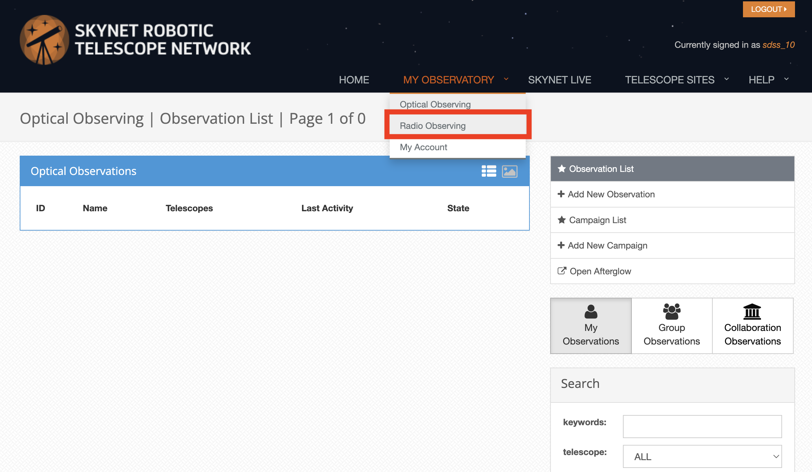
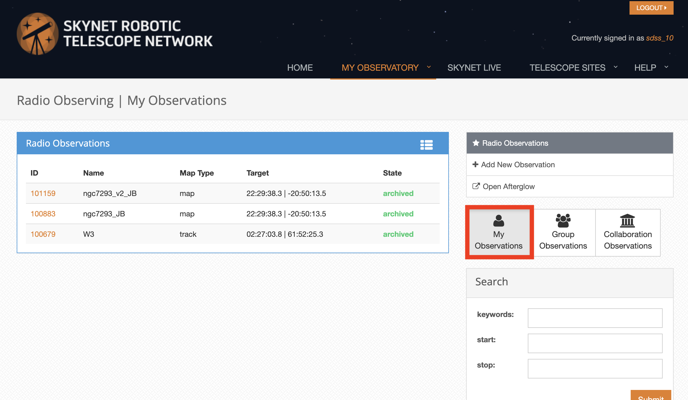
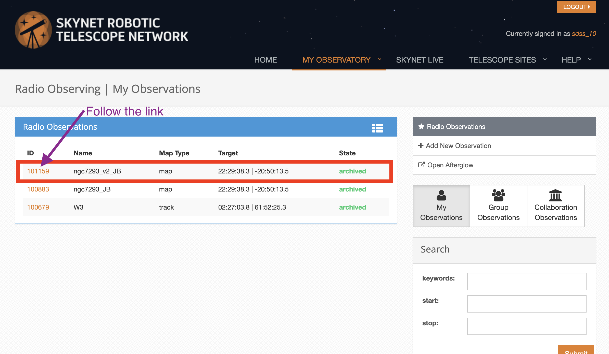
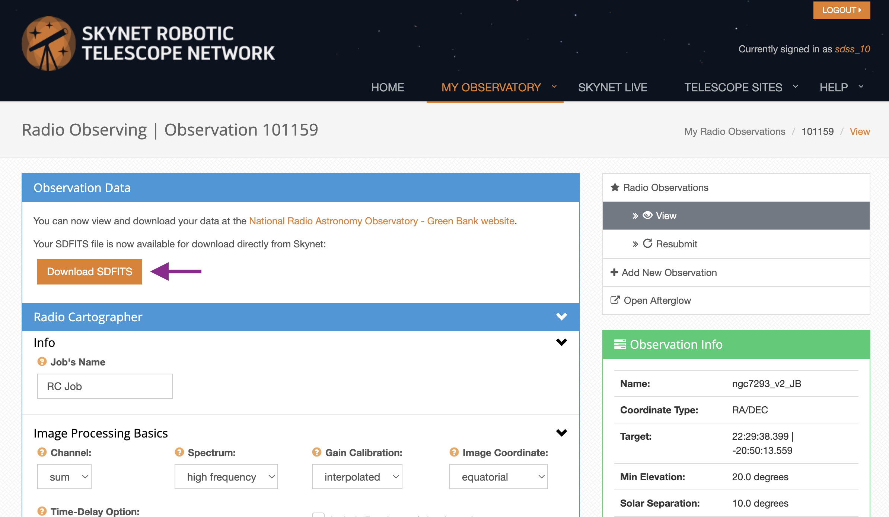
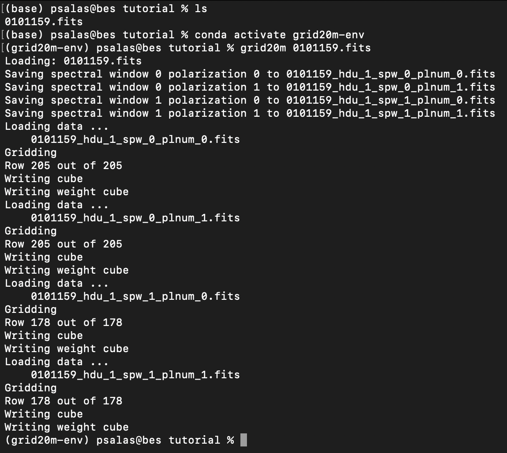

.. mapping_tutorial:

################
Mapping Tutorial
################

This tutorial shows how to make cubes out of 20m mapping observations.

For this tutorial you will need

* a working internet connection
* at least 500 MB of free disk space
* a `skynet <https://skynet.unc.edu/>`_ account
* `grid20m` installed (see :ref:`installation`)
* a mapping observation with the 20m telescope at Green Bank.

Data Retrieval
--------------

Login to your skynet account. Select Radio Observing from the drop down menu.

Go to your observations.

Select an observation of the type "map" and follow the link on the ID column.

Click on the "Download SDFITS" button. This will start the download of the mapping data.

Save the data into the directory where you will work.

Map Making
----------

In the directory where you saved the mapping data open up a new terminal.
If you installed `grid20m` in a separate `Python` environment, make sure to have that environment activated.
Use the command `grid20m` to generate data cubes

.. code-block:: bash

    grid20m 0101159.fits

The following image shows the outputs from the above command

If the command finishes successfully you will now have four (the exact number depends on the data you are using) data cubes. For the above example these would be:

1. 0101159_hdu_1_spw_0_plnum_0_cube.fits
2. 0101159_hdu_1_spw_0_plnum_1_cube.fits
3. 0101159_hdu_1_spw_1_plnum_0_cube.fits
4. 0101159_hdu_1_spw_1_plnum_1_cube.fits

and four weight images:

1. 0101159_hdu_1_spw_0_plnum_0_weight.fits
2. 0101159_hdu_1_spw_0_plnum_1_weight.fits
3. 0101159_hdu_1_spw_1_plnum_0_weight.fits
4. 0101159_hdu_1_spw_1_plnum_1_weight.fits

The data cubes can be inspected using tools like `SAOImageDS9 <https://sites.google.com/cfa.harvard.edu/saoimageds9/download>`_, `CASA <https://casa.nrao.edu/>`_, `Astropy <https://docs.astropy.org/en/stable/index.html>`_ or any tool that can handle FITS image cubes.
